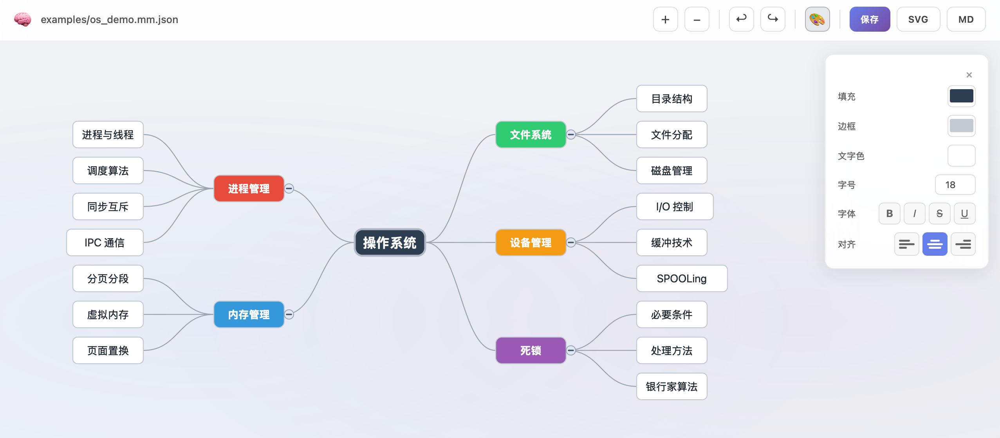

<p align="center">
  
</p>

<p align="center">
  
  
  
</p>

<h1 align="center">Zone Mindmap</h1>

<p align="center">
  A minimal, zero-dependency mind-mapping tool.<br>
  CLI editing + Web UI in pure Python stdlib.
</p>

---

## Quick Start

```bash
# CLI — create, edit, render
python -m mindmap.presentation.cli new "Plan" --root "Ideas" -o map.mm.json
python -m mindmap.presentation.cli add <id> "Feature" --doc map.mm.json
python -m mindmap.presentation.cli render map.mm.json -o map.svg

# Web UI
pip install flask
python server.py
# → http://localhost:5000/?path=examples/os_demo.mm.json
```

## Features

- **Zero dependencies** — core is pure Python stdlib (Flask only needed for Web UI)
- **CLI + Web UI** — command-line editing and interactive SVG viewer/editor
- **Tree editing** — add, edit, remove, move, reorder nodes (Tab/Enter/F2/Delete)
- **Per-node styles** — independent fill, stroke, text color, font size per node
- **Auto-balanced layout** — maximizes screen space with left/right split
- **SVG export** — polished vector output with bezier connectors and themes
- **Markdown round-trip** — import/export indented Markdown lists
- **JSON persistence** — human-readable `.mm.json` format

## Web UI

<p align="center">
  
</p>

```
http://localhost:5000/?path=examples/os_demo.mm.json
```

| Shortcut | Action |
|----------|--------|
| `Tab` | Add child node |
| `Enter` | Add sibling (below) |
| `Shift+Enter` | Add sibling (above) |
| `Ctrl+Enter` | Add parent node |
| `F2` / Double-click | Edit node text |
| `Delete` | Delete node |
| `Alt+↑↓` | Reorder sibling |
| Drag node | Move to new parent |
| Mouse wheel | Zoom |
| Drag canvas | Pan |
| Right-click | Context menu |

## Usage

```bash
# Document lifecycle
mm new "Title" --root "Root" -o map.mm.json    # create
mm open map.mm.json                               # view tree
mm ls --doc map.mm.json                           # list nodes

# Editing
mm add <parent_id> "Child" --doc map.mm.json
mm edit <node_id> --text "Updated" --doc map.mm.json
mm move <node_id> --to <new_parent> --doc map.mm.json
mm rm <node_id> --doc map.mm.json

# Style
mm style <node_id> --fill "#e74c3c" --font-size 16 --doc map.mm.json
mm unstyle <node_id> --doc map.mm.json

# Export
mm render map.mm.json -o map.svg
mm to-md map.mm.json -o map.md
mm from-md map.md -o map.mm.json
```

## Architecture

### Data Flow

```
┌───────────────────────────────────────┐
│              Frontend                 │
│  ┌────────────────────────────────┐   │
│  │        Web UI (SVG+JS)         │   │
│  │   viewer · editor · keyboard   │   │
│  └────────────────────────────────┘   │
├───────────────────────────────────────┤
│              Data Plane               │
│  ┌──────────┐  ┌────────────────────┐ │
│  │  server  │  │     Core Engine    │ │
│  │  Flask   │  │   Model   Layout   │ │
│  │  REST    │  │   Render  Storage  │ │
│  └──────────┘  └────────────────────┘ │
│  ┌──────────────────────────────────┐ │
│  │            CLI (mm)              │ │
│  └──────────────────────────────────┘ │
└───────────────────────────────────────┘
```

### How It Works

**CLI path:** `mm add <id> "text" --doc map.mm.json`
1. CLI parses args → calls `MindMapService`
2. Service loads `.mm.json` via `JsonFileRepository`
3. Domain model mutates the tree (`MindMap.add_child()`)
4. Service saves back to disk

**Web UI path:** `Tab` key in browser
1. Browser keyboard event → `APP.addChild()` (app.js)
2. `POST /api/node/add-child` → `server.py` receives mindmap JSON
3. Server deserializes → mutates domain → recomputes layout
4. Returns `{mindmap, boxes}` → browser re-renders SVG

**Render path:** `mm render map.mm.json -o map.svg`
1. Load domain model from file
2. Compute layout coordinates (`layout/`)
3. Apply theme + style overrides (`rendering/`)
4. Emit SVG string

## File Format

```json
{
  "id": "a1b2c3d4",
  "title": "My Map",
  "root": { "id": "e5f6g7h8", "text": "Root", "children": [] },
  "styles": { "e5f6g7h8": { "fill": "#2c3e50", "text_color": "#ffffff" } }
}
```

Saved as `.mm.json`. The `styles` key is optional.

## Roadmap

- [x] **M1-M2** — Core model, layout, SVG rendering
- [x] **M3-M4** — Node editing, per-node styles
- [x] **M5** — Web UI viewer + editor (zoom, pan, edit, drag)
- [x] Collapse/expand branches
- [x] Undo history
- [x] Style panel in Web UI (B/I/S/U, alignment, color, font-size)

## License

MIT
